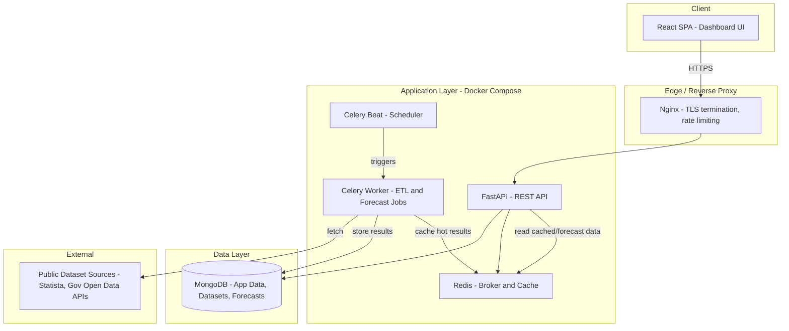
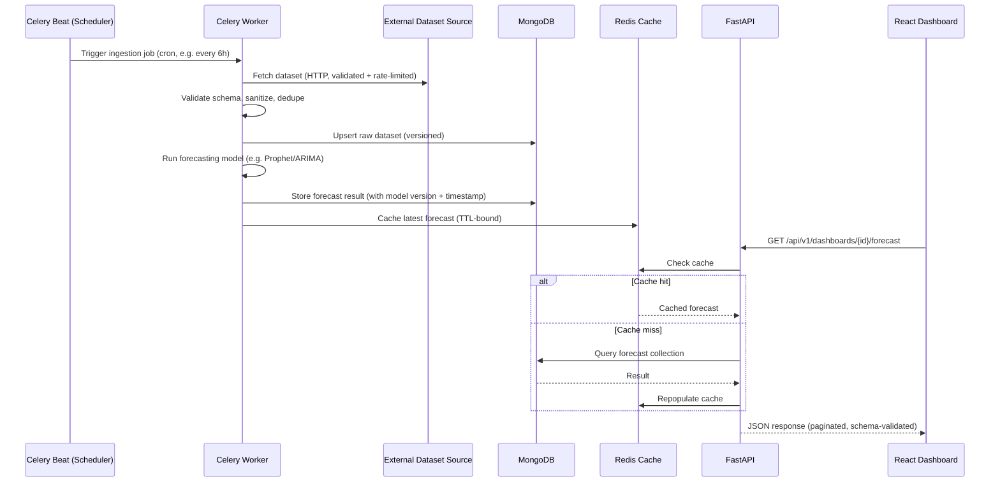
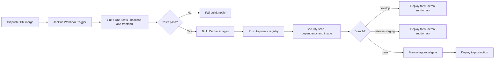
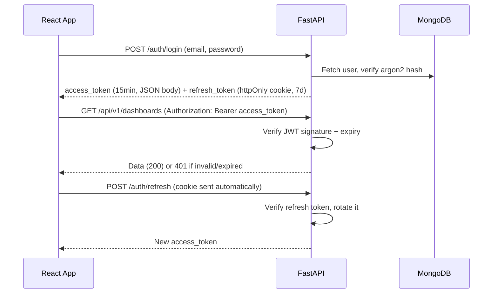

# AI-Powered Trading & Data Analytics Dashboard — Production Architecture Plan

## 1. Problem Statement

Build a Tableau/Power BI-style analytics dashboard that ingests public
government/economic datasets (Statista-style sources), runs time-series
forecasting/trend-detection models on that data, and presents results
through a React dashboard — deployed with the team's existing stack
(FastAPI, MongoDB, Jenkins, Docker Compose, v1/v2 demo subdomains).

This is **not** a live trading feed system. Data arrives on a schedule
(ETL jobs), not via streaming WebSocket ticks. That single fact drives
most of the architecture below — it means you need a robust batch
pipeline and job scheduler, not a real-time streaming stack.

---

## 2. Stack Decision & Justification

| Layer | Choice | Why |
|---|---|---|
| Backend API | **FastAPI** (not Django) | Async-native (ASGI) — needed for concurrent calls to external data sources, background job triggers, and future WebSocket push. Pydantic gives strict request/response validation out of the box, which directly satisfies the "validate all input" requirement. Django's ORM is relational-first; you're on MongoDB, which weakens Django's main advantage (admin+ORM). You don't need server-rendered templates — this is a pure API behind a React SPA. |
| Database | **MongoDB** | Good fit for heterogeneous dataset schemas (different public datasets have different shapes) and for storing forecast-result documents. **Caveat:** MongoDB is a poor fit for raw time-series storage at scale — see §4.2 for the mitigation (MongoDB Time Series Collections, introduced in 5.0+). |
| Job scheduling / ETL | **Celery + Redis**, or **APScheduler** for simpler v1 | Dataset ingestion and forecasting are periodic batch jobs, not request-time work. Never run a forecasting model inside an HTTP request thread. |
| Frontend | **React** + **TailwindCSS** | Per team convention. Charting via **Apache ECharts** or **Recharts** (both free/open-source — matches the "free OSS libraries" requirement your friend gave). Avoid Highcharts/AmCharts (commercial license). |
| Auth | **JWT (access + refresh token pair)**, httpOnly cookie for refresh token | No session state needed in Mongo; stateless access tokens scale horizontally. |
| CI/CD | **Jenkins** (existing), private server | Documented in §7. |
| Deployment | **Docker Compose** | Per team convention. Not Kubernetes — don't over-engineer past what's asked. |
| Environments | `v1-demo.yourdomain.com`, `v2-demo.yourdomain.com` | Matches team's existing subdomain-per-version testing pattern. |

---

## 3. High-Level Architecture



**Key decision:** the forecasting engine runs as a **Celery worker**, fully
decoupled from the FastAPI request/response cycle. FastAPI only ever reads
pre-computed results from MongoDB/Redis. This is non-negotiable for
production — synchronous ML inference inside an HTTP handler will time out
under load and blocks the event loop for every other user.

---

## 4. Data Flow

### 4.1 Ingestion → Forecast → Display pipeline



### 4.2 Why MongoDB needs a specific strategy here, not default collections

Time-series data (date, metric, value) dumped into a normal MongoDB
collection degrades badly at scale — no columnar compression, expensive
range queries. Two options, pick based on data volume:

- **Small/medium volume (< a few million points/dataset):** MongoDB
  **Time Series Collections** (`timeseries` collection type, native since
  5.0). Gives automatic bucketing and much better compression/query perf
  than a plain collection, with zero extra infrastructure.
- **Large volume / heavy analytical queries:** consider a dedicated
  columnar store (TimescaleDB/ClickHouse) alongside Mongo, with Mongo kept
  for app/user/metadata. **Don't build this until you actually hit the
  wall** — start with Time Series Collections, measure, then migrate the
  hot path only if needed.

### 4.3 Collection design (MongoDB)

```
users              { _id, email, hashed_password, role, created_at, ... }
datasets_meta       { _id, source_name, source_url, schema_version, last_synced_at }
dataset_points      { _id, dataset_id, ts, metric, value }   // timeseries collection
forecasts           { _id, dataset_id, model_version, generated_at, horizon, predictions[] }
audit_logs          { _id, user_id, action, resource, ip, timestamp }   // never log payloads with secrets
```

**Key logic decision:** `forecasts` documents are immutable and versioned
by `(dataset_id, model_version, generated_at)` — never overwrite a
forecast in place. This gives you a full audit trail of model output over
time, which matters both for debugging model drift and for any future
compliance need around "what did the AI predict and when."

---

## 5. Backend Structure (FastAPI)

```
/backend
├── app/
│   ├── main.py                 # FastAPI app init, middleware, routers
│   ├── core/
│   │   ├── config.py            # env-based settings (pydantic-settings)
│   │   ├── security.py          # JWT issue/verify, password hashing (argon2)
│   │   └── logging.py           # structured logging, no PII/secrets
│   ├── api/
│   │   └── v1/
│   │       ├── routes_auth.py
│   │       ├── routes_datasets.py
│   │       ├── routes_forecasts.py
│   │       └── dependencies.py  # auth guards, rate-limit deps
│   ├── services/
│   │   ├── dataset_service.py   # business logic, ONE responsibility each
│   │   ├── forecast_service.py
│   │   └── cache_service.py
│   ├── repositories/
│   │   ├── dataset_repository.py   # all Mongo queries isolated here
│   │   └── forecast_repository.py
│   ├── schemas/
│   │   ├── dataset_schema.py    # Pydantic request/response models
│   │   └── forecast_schema.py
│   ├── workers/
│   │   ├── celery_app.py
│   │   ├── tasks_ingest.py
│   │   └── tasks_forecast.py
│   └── models/
│       └── db_models.py         # Mongo document shape definitions
├── tests/
│   ├── unit/
│   └── integration/
├── requirements.txt
├── Dockerfile
└── alembic/  (not used with Mongo — omit; kept structure explicit for clarity)
```

**Modularity rule applied:** routes never touch MongoDB directly. Flow is
strictly `route → service → repository → DB`. This keeps each layer
testable in isolation and stops business logic leaking into HTTP handlers.

---

## 6. Frontend Structure (React + Tailwind)

```
/frontend
├── src/
│   ├── api/
│   │   └── client.ts             # axios instance, interceptors, auto token refresh
│   ├── features/
│   │   ├── auth/
│   │   ├── dashboard/
│   │   │   ├── components/
│   │   │   ├── hooks/            # useForecastData, usePolling
│   │   │   └── DashboardPage.tsx
│   │   └── datasets/
│   ├── components/                # shared, dumb/presentational only
│   ├── lib/
│   │   └── charting/              # ECharts/Recharts wrapper config
│   ├── store/                     # Zustand or Redux Toolkit — pick one
│   └── App.tsx
├── tailwind.config.js
├── package.json
└── Dockerfile
```

**Free/OSS libraries matching your friend's Pinterest/Dribbble-sourced
UI direction:**
- Charts: **Recharts** (simpler) or **Apache ECharts** (more powerful,
  better for dense financial-style dashboards)
- Component primitives: **shadcn/ui** (Tailwind-native, unstyled-by-default
  so it won't fight your custom design direction) or **Radix UI** directly
- Icons: **Lucide**
- Animation (if the Dribbble references want motion): **Framer Motion**

All are MIT-licensed, no attribution/paywall traps.

---

## 7. CI/CD Pipeline (Jenkins → Docker Compose → v1/v2 subdomains)



**Key logic decisions:**
- **v1-demo** = active development integration environment (deploys on
  every merge to `develop`). **v2-demo** = release-candidate/staging
  environment (deploys on merge to `release/*`, used for the 2-person
  security/QA team to sign off before prod). This mirrors what your
  friend described and gives your 2 testers a stable target that isn't
  changing every commit.
- **Security scan stage is mandatory, not optional** — run `pip-audit` /
  `npm audit` for dependency CVEs and **Trivy** for Docker image
  vulnerability scanning, both free/OSS. Fail the build on high/critical
  findings; don't just log them.
- **Production deploy requires manual approval** (Jenkins `input` step) —
  never auto-deploy `main` straight to prod with only 2 security/test
  people in the loop; they need a deliberate gate, not a race against CI.

### Jenkinsfile structure (reference, not full script)

```
/Jenkinsfile
├── stage('Checkout')
├── stage('Install & Lint')          # eslint, ruff/flake8
├── stage('Unit Tests')              # pytest, jest
├── stage('Build Images')            # docker compose build
├── stage('Dependency & Image Scan') # pip-audit, npm audit, trivy
├── stage('Push to Registry')
├── stage('Deploy v1-demo')          # on develop branch
├── stage('Deploy v2-demo')          # on release/* branch
└── stage('Deploy Production')       # on main, behind manual approval
```

### docker-compose structure (per environment)

```
/deploy
├── docker-compose.base.yml       # shared service definitions
├── docker-compose.v1-demo.yml    # override: ports, env file, replicas=1
├── docker-compose.v2-demo.yml    # override: staging env vars
├── docker-compose.prod.yml       # override: resource limits, restart policy
└── .env.{environment}            # never committed — Jenkins injects at deploy time
```

**Security decision:** secrets (Mongo URI, JWT signing key, API keys for
dataset sources) live in Jenkins Credentials Store, injected as env vars
at deploy time — **never committed to the repo, never baked into the
Docker image**. Each environment gets its own `.env` file generated at
deploy time only.

---

## 8. Security Model (for your 2-person security/testing team)

### 8.1 Input validation & injection prevention

- All request bodies validated via **Pydantic schemas** — reject before
  any business logic runs (fail fast, no partial processing of malformed
  input).
- MongoDB queries built exclusively through **PyMongo/Motor query
  builders** — never string-concatenate user input into a query filter
  (prevents NoSQL injection via `$where`/operator injection).
- File uploads (if any dataset upload UI is added later): validate MIME
  type + magic bytes (not just extension), enforce size limits, scan
  before storage.

### 8.2 AuthN/AuthZ



- Passwords hashed with **argon2** (not bcrypt — argon2 is the current
  OWASP recommendation), never logged, never returned in any response.
- Refresh token stored in **httpOnly, Secure, SameSite=Strict cookie** —
  inaccessible to JS, mitigates XSS token theft.
- Role-based access control (`admin`, `analyst`, `viewer`) enforced as a
  FastAPI dependency on every protected route — checked server-side, never
  trust a role claim the frontend sends unverified.

### 8.3 Standard web threats

| Threat | Mitigation |
|---|---|
| XSS | React escapes output by default — **never use `dangerouslySetInnerHTML`** with unsanitized data. CSP header set at Nginx level. |
| CSRF | Not applicable to Bearer-token API calls from JS, but the refresh-cookie flow needs `SameSite=Strict` + origin checking on `/auth/refresh`. |
| SQL/NoSQL Injection | Parameterized queries only, as above. |
| Command Injection | Dataset ingestion never shells out to construct commands from external data — all external HTTP calls use a fixed, whitelisted set of source URLs, not user-supplied URLs. |
| Secrets exposure | `.env` files gitignored, secrets in Jenkins Credentials Store, `.dockerignore` excludes env files from image build context. |
| Rate limiting / brute force | Nginx rate limiting on `/auth/*` routes; consider `slowapi` (FastAPI rate-limit middleware, free/OSS) for per-user API limits. |

### 8.4 What the 2-person security team should actually own

- **Person A (security-focused):** dependency/image scanning gate in
  Jenkins (§7), periodic manual penetration test pass on `v2-demo`
  (auth flows, IDOR checks on dataset/forecast IDs, rate-limit
  verification), secrets rotation policy.
- **Person B (QA-focused):** functional test suite (pytest for backend,
  Playwright/Cypress for frontend E2E) run in CI, regression testing on
  `v1-demo` per merge, sign-off checklist before promoting `v2-demo` →
  `main`.

Don't blur these — a 2-person team covering both security and QA works
only if the split is explicit; otherwise both scans and functional tests
degrade under time pressure.

---

## 9. Error Handling & Logging

- Global FastAPI exception handler returns a **generic error message +
  correlation ID** to the client; full stack trace goes only to server
  logs — never leak internal exception details (stack traces, DB
  connection strings, file paths) in HTTP responses.
- Structured JSON logging (not print statements) — use Python's `logging`
  with a JSON formatter, ship to a log aggregator later if needed.
- **Never log:** passwords, JWT tokens, full request bodies containing
  credentials, raw Mongo connection strings.
- Log **always:** auth attempts (success/fail), forecast job
  start/completion/failure, admin actions, rate-limit rejections.

---

## 10. Performance Considerations

- **Redis caching** for forecast results (§4.1) — avoids recomputing or
  re-querying Mongo on every dashboard load; TTL matched to ingestion
  frequency (no point caching longer than data freshness).
- **Pagination mandatory** on all list endpoints (`/datasets`,
  `/forecasts`) — never return unbounded result sets.
- **Indexes:** compound index on `(dataset_id, ts)` for `dataset_points`,
  index on `(dataset_id, generated_at)` for `forecasts` — without these,
  queries degrade to collection scans as data grows (O(n) → effectively
  O(log n) with proper indexing).
- Forecasting jobs run on a **schedule, not on-demand per request** — this
  is the single biggest performance decision in this system; it converts
  an expensive synchronous compute path into a cheap cached read.

---

## 11. Build Order (Recommended Sequence)

1. **Foundation:** FastAPI skeleton + MongoDB connection + JWT auth +
   Docker Compose for local dev.
2. **Data layer:** dataset ingestion Celery task for one source, Mongo
   Time Series Collection, basic `/datasets` API.
3. **Frontend shell:** React app, auth flow, layout, connects to real
   `/datasets` endpoint (no charts yet — prove the pipe works end to end).
4. **Forecasting:** add forecast Celery task (start with a simple model —
   Prophet or statsmodels ARIMA — before reaching for anything heavier),
   `/forecasts` API, Redis caching.
5. **Dashboard UI:** charting components, connect to `/forecasts`.
6. **CI/CD:** Jenkins pipeline, v1-demo deploy, security scan stage.
7. **Hardening:** rate limiting, audit logging, v2-demo staging gate,
   security team pass before first production deploy.

Do not build the forecasting model before the ingestion pipeline is
proven reliable — a sophisticated model on top of unvalidated,
inconsistently-shaped external data will silently produce garbage
predictions with no clear signal of *why*.
